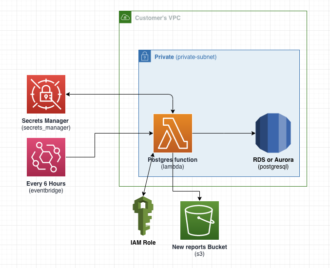

## Purpose
Lambda with schedule (Amazon Eventbridge) of every 6 hours, Query and report RDS/Aurora Postgres information not available via performance insights. After each run the lambda generates HTML file \<date>-report.html after each run and save to S3 bucket in the your account.   

### Insights:
* General Instance Details and Configuration
* Total Size of Log Files
* Total Size of ALL Databases
* Maximum Used Transaction IDs
* Top 25 Databases Size
* Top 25 Biggest Tables
* Duplicate Indexes
* Unused Indexes
* Database Age
* Top 25 Most Bloated Tables
* Top 25 Biggest Tables Last Vacuumed
* Top 25 UPDATE/DELETE Tables
* Top 25 Read IO Tables
* Vacuum Parameters
* Memory Parameters
* Performance Parameters
* Top 25 CPU Consuming SQLs*
* Top 25 Read Queries*
* Top 25 Write Queries*

*if you have pg_stat_statements installed, will skip if not.

## Architecture:


### Requirements:
* VPC with private subnets.
* A postgres database!.
* DB username and password stored in Secrets Manager.

### Artifacts and Components:
* Lambda function.
  * with 1 3rd party Component (psycopg2)
* Eventbridge schedule.
* S3 Bucket (one per region per account).
  * recommended that you enable access logging manually to your logging bucket.
* html files in the bucket.
* IAM role:
  * logs: (PutLogEvents, CreateLogStream, CreateLogGroup) for lambda send put logs to cloudwatch.
  * s3: (PutObject, ListBucket, CreateBucket, PutEncryptionConfiguration) to create and upload files to S3.
  * rds: (DescribeDBLogFiles, DescribeDBClusters, DescribeDBInstances) to get RDS/Aurora information.
  * sts: (getCallerIdentity) for getting the account number.
  * secretsmanager: (GetSecretValue) to get the credentials and other DB information from SecretsManager

### Inputs
#### SAM template inputs
* stack-name: the new stack name
* s3-bucket: Bucket where the SAM package will be uploaded
* capabilities CAPABILITY_IAM: needed for creating the role
* parameter-overrides:
  * securityGroup: the security group for the lambda function
  * subnet1: a private subnet where the function can reach the target DB
  * subnet2: a 2nd private subnet where the function can reach the target DB
  * region: AWS region where the lambda need to be deployed
  * secid: the secrets manager secretID where the DB details stored

#### Lambda inputs
Required input (handled by EventBridge):     
* sid

The lambda will retrieve the required details from AWS Secrets Manager based on the SecretID provided

If you want to invoke the lambda directly outside the scheduled event you can attach an ALB or API gateway.   
You can either pass the required input by API body or query parameters:
```
curl --location --request GET 'http://127.0.0.1:3000/' \
--header 'Content-Type: application/json' \
--data-raw '{
  "sid": "demo-postgres"
  }'
```
OR
```
http://127.0.0.1:3000/?sid=demo-postgres
```
## Networking:
This lambda need to be in a VPC with connectivity to the target Database, in a private subnet that have access to the internet or have the following endpoints enabled:
* STS
* S3
* RDS
* Secrets Manager

### Outputs:
Create S3 Bucket with name (if not there): rds-reports-\<aws_region>-\<accountID>   
Save reports to that bucket after each run with name: \<datetime>-\<rdsName>report.html

### Local testing:
to start locally:    
`sam build && sam local start-api`

### Using SAM to Deploy
`sam build && sam deploy --stack-name <NEWSTACKNAME> --s3-bucket <EXISTINGS3BUCKET> --capabilities CAPABILITY_IAM --parameter-overrides securityGroup=sg-1234567890 subnet1=subnet-1111111111111 subnet2=subnet-2222222222 --region <REGION> secid=<secretID>`

### TODO:
* Make the html human readable!
* add auto-logging to the s3 bucket
